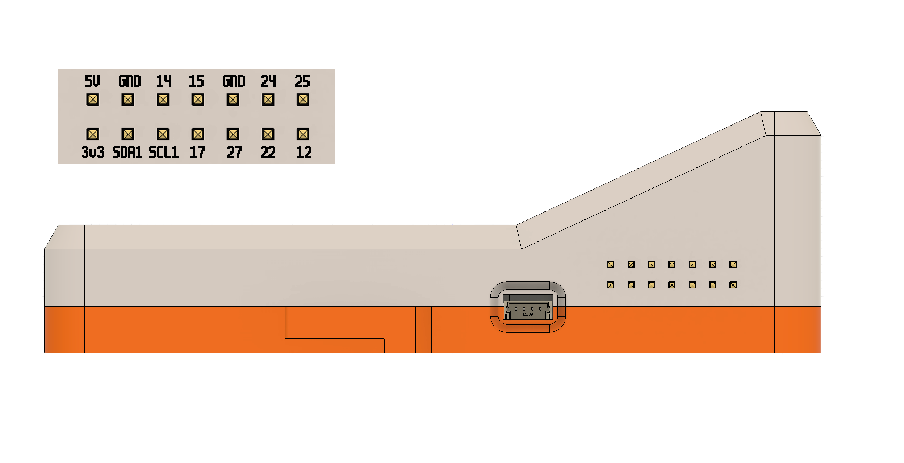

# Device Setup and Usage Guide

## Power Setup

To power on the device, connect it to the provided power supply using the first USB-C port on the left side of the device.

**Power Requirements:**
- Minimum 27W power supply
- 9V at 3A output
- Use only the leftmost USB-C port for power

## Initial Network Setup

### First-Time WiFi Configuration

1. When the device has never been connected to your network, it will automatically prompt you to scan a QR code
2. Scanning this QR code opens a website where you can enter your WiFi network credentials
3. Complete the setup process by entering the desired network information
4. Once setup is complete, the device will connect to the network and display a new QR code

### Accessing the Web Interface

After initial setup, scan the new QR code displayed on the device screen. This will redirect you to the device's web interface.

## Project Management

The web interface provides a GUI for easy project creation and management:

- Create new projects through the graphical interface
- All projects are created in the `projects` directory located inside the home directory
- Open dedicated terminal sessions (tmux) for each project
- Support for multiple terminals per project or working on different projects simultaneously
- Sessions are persistent as long as the device is powered on
- Work on projects directly from the terminal environment

### Mobile Access

You can switch to your phone to continue working when you need to step away from your laptop. The mobile UI is still a work in progress, but remains very usable for most tasks.

### File Management

The web interface includes a built-in file explorer that allows you to:
- Browse project files and directories
- Download files to your local device by right-clicking and selecting download
- Conveniently transfer files between the device and your local machine

## Claude Code Integration

The device comes with Claude Code pre-installed and ready to use.

**Important:** Always use `distiller-cc` instead of the standard `claude` command. The `distiller-cc` wrapper automatically loads the entire hardware SDK context, enabling you to ask questions about the hardware directly without needing to reference documentation manually.

### Standard Mode

Launch Claude Code from any directory using:

```bash
distiller-cc
```

This command is a wrapper around the standard `claude` command that:
- Sets up a default Claude Code environment with custom permissions configured for optimal security
- Automatically loads comprehensive hardware SDK documentation into context
- Enables direct hardware-related questions and programming assistance

You can ask Claude about any aspect of the hardware, including GPIO pins, sensors, displays, audio, camera, and more - it has complete knowledge of the hardware SDK.

### Hardware Reference

For GPIO pin configurations and hardware connections, refer to the pin-out diagram below:



### YOLO Mode

For advanced users who want fewer restrictions:

```bash
distiller-cc yolo
```

This launches Claude Code with less restrictive permissions, requiring minimal user intervention. Use with caution as this reduces safety guardrails.

## Status LED System

The device features status lights that indicate the current state of the Claude Code REPL:

| LED Color | Status | Description |
|-----------|--------|-------------|
| **Yellow** | Request Acknowledged | Claude has received and acknowledged your request |
| **Blue** | Tool Execution / Waiting | Claude is either calling a tool or waiting for user permission |
| **Green** | Tool Completed | A tool call has returned results and Claude is proceeding to the next task |

### Monitoring Workflow

- **Yellow**: Your request is being processed
- **Blue**: Claude is actively working or requires permission
  - If the LED stays blue for an extended period, Claude may be waiting for user approval
- **Green**: Task completion, Claude is moving on to the next operation

This LED system allows you to monitor Claude's progress without constantly checking the terminal, letting you work hands-free while staying informed about the system status.